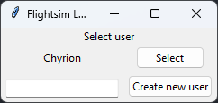
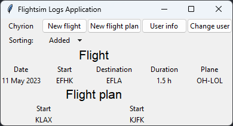
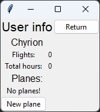
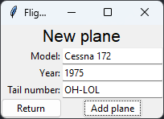
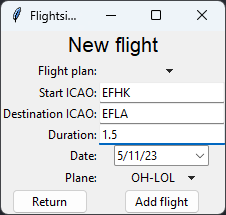
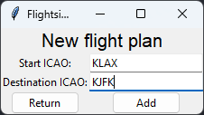

# Käyttöohje

# Käyttöönotto

1. Lataa sovelluksen viimeisin [release](https://github.com/Chyrion/ot-harjoitustyo/releases)
2. Pura tiedostot kansioon, ja suorita siellä
```
poetry install
```
3. Käynnistä sovellus suorittamalla
```
poetry run invoke start
```

### Huomio sovelluksen toiminnasta

Sovellus tallentaa käyttäjien tiedot tiedostoihin, jotka sijaitsevat sovelluksen kotikansion sisällä olevassa kansiossa ```userfiles```. Varmista siis, että sovellus on sijainnissa, jossa se pystyy luomaan ja lukemaan tiedostoja.


# Käyttö

## Käyttäjävalinta

Sovelluksen käynnistyessä aukeaa käyttäjävalinta. Uusia käyttäjiä voi luoda alareunan tekstikentän avulla.



## Kotinäkymä

Kotinäkymä näyttää käyttäjän omat lennot (mikäli niitä on) ja niiden tiedot, sekä tallennetut lentosuunnitelmat. Yläreuna sisältää navigaation [infonäkymään](#infonäkymä), [uuden lennon lisäämiseen](#uusi-lento), [uuden lentosuunnitelman lisäämiseen](#uusi-lentosuunnitelma) sekä käyttäjän vaihtoon.



## Infonäkymä

Infonäkymässä on kooste käyttäjän tilastoista sekä lista lisätyistä lentokoneista. Yläreunasta käyttäjä voi siirtyä lisäämään uuden lentokoneen itselleen.



## Uusi lentokone

Näkymän avulla voi lisätä käyttäjälle uuden lentokoneen.

Kentät:
- Model: Lentokoneen malli (esim. Cessna 172, Piper PA-28, Piper J-3, Diamond DA42)
- Year: Lentokoneen valmistusvuosi
- Tail number: Lentokoneen peränumero. Voi olla käytännössä mikä tahansa merkkiyhdistelmä, mutta oikeasti ne ovat kirjaimia, numeroita (ja viivoja). Esimerkkejä oikeista peränumeroista: OH-SHT, OH-ATO, EI-DGU, PH-TFN, HL8217, N5921C, N390GM, N318JJ

Kun lentokoneen tiedot ovat kunnossa, se lisätään infonäkymässä näkyvään listaan.



## Uusi lento

Kotinäkymästä käyttäjä voi valita uuden lennon lisäämisen. Huomioi, että lentoa ei voi luoda, ellei käyttäjällä ole vähintään 1 lentokone lisättynä.

Kentät:
- Flight plan: Mikäli käyttäjä on luonut itselleen lentosuunnitelmia, ne näkyvät tässä valikossa. Jos jokin lentosuunnitelma valitaan, sen lähtö- ja päämäärälentokentät sijoitetaan alempiin kenttiin.
- Start ICAO/Destination ICAO: kentät vaativat 4-kirjaimisen ICAO koodin - tämä voi olla tässä vaiheessa käytännössä mikä tahansa yhdistelmä merkkejä, mutta esimerkkejä oikeista ICAO koodeista ovat: EFHK, EFLA, EGLL, LFPG, KJFK, KLAX, RJAA.
- Duration: kenttään syötetään lennon kesto tunneissa joko kokonais- tai desimaalinumerona (huom. desimaalipilkku/piste voi antaa virheen, vaihda toiseen jos niin on).
- Date: Lennon päivämäärä, joka valitaan kalenterista.
- Plane: Valikosta voi valita lentokoneen, jolla lento on lennetty. Valikko on vain saatavilla jos käyttäjä on lisännyt itselleen vähintään 1 lentokoneen, ja ilman lentokoneen valintaa lentoa ei voi lisätä.
 
Kun lennon tiedot ovat kunnossa, se lisätään käyttäjän lokiin ja lento ilmestyy kotinäkymän listalle.
 


## Uusi lentosuunnitelma

Kotinäkymästä käyttäjä voi valita uuden lentosuunnitelman lisäämisen. Lentosuunnitelmilla käyttäjä voi suunnitella tulevia lentoja, mutta ne toimivat myös pohjina uuden lennon lisäämiseen.

Kentät:
- Start ICAO/Destination ICAO: kentät vaativat 4-kirjaimisen ICAO koodin - tämä voi olla tässä vaiheessa käytännössä mikä tahansa yhdistelmä merkkejä, mutta esimerkkejä oikeista ICAO koodeista ovat: EFHK, EFLA, EGLL, LFPG, KJFK, KLAX, RJAA.


