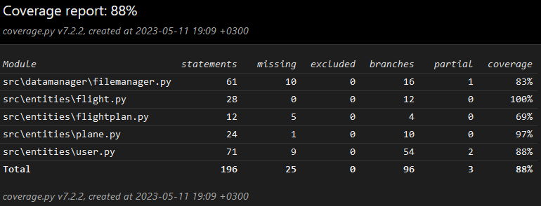

# Testaus

## Yksikkö- ja integraatiotestaus

Suuri osa testauksesta tapahtuu [TestFileManager](../src/tests/datamanager/filemanager_test.py):n `FileManager`-luokan testien kautta. Testausta varten ei luoda erillistä kopioluokkaa, vaan luokasta luodaan sellaisenaan olio joka tallentaa sovelluksen tavoin testeissä tapahtuvat tiedot levylle. Testitiedostot kuitenkin poistetaan testien jälkeen.

`User`-luokkaa testataan yhtä testiä lukuunottamatta luomalla uusi User-olio, jonka sisältämiin listoihin lisätään testin mukaiset oliot. Testit ovat kaikki `User`:in sisäisiä, eli niillä ei ole yhteyttä tiedosto-operaatioihin, vaan se käyttää muita `entities`-ryhmästä löytyviä olioita. `User` on ainut `entity` joka suoranaisesti sisältää testattavan arvoista koodia, ja muut entityt testataan `FileManager` ja `User` testien kautta.

### Testauskattavuus

Testauskattavuus on 88%.

## Järjestelmätestaus

Sovellusta on testattu manuaalisesti. Testaus on suoritettu Windows- sekä Linux-ympäristöissä käyttöohjeen mukaisesti. Testaus on lähinnä pohjautunut vain peruskäyttöön ja perustoiminnallisuuden varmistamiseen.

### Toiminnallisuus

Vaatimusmäärittelydokumentin mukaiset toiminnallisuudet on lisätty, ja niiden perustoiminnallisuus on testattu. Osa toiminnallisuudesta perustuu syötteisiin ja niiden käsittelyyn, mutta erilaisia virhesyötteitä ei ole kuitenkaan testattu.

## Laatuongelmat

- Jos `FileManager` ei pysty oikeuksien vuoksi luomaan tarpeellisia kansioita ja tiedostoja, kaikki toiminnallisuus hajoaa
- Tiedostonkäsittelyssä tapahtuvat virheet eivät ilmoita virheistään
- Syötteiden käsittely on paikoitellen puutteellista ja epäkonsistenttia, joka saattaa johtaa virheelliseen toimintaan

